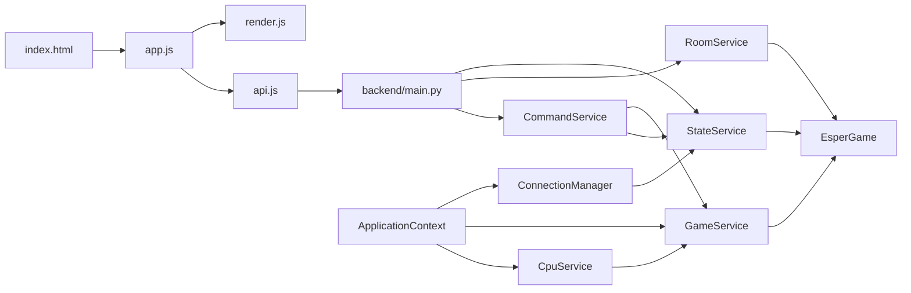
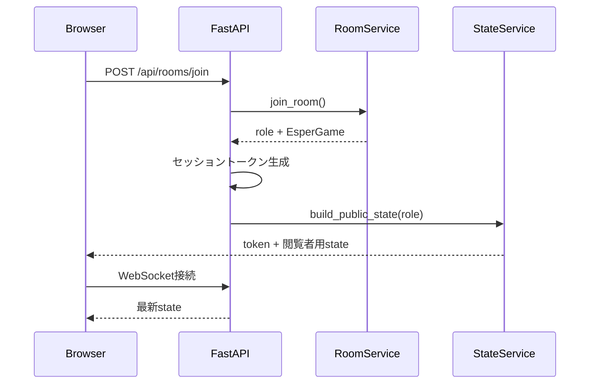
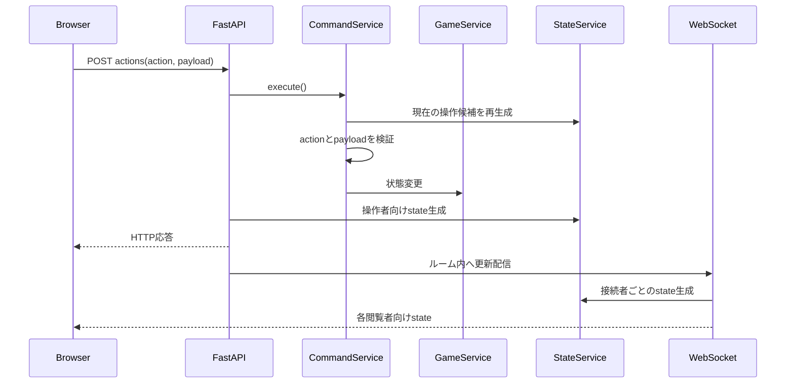
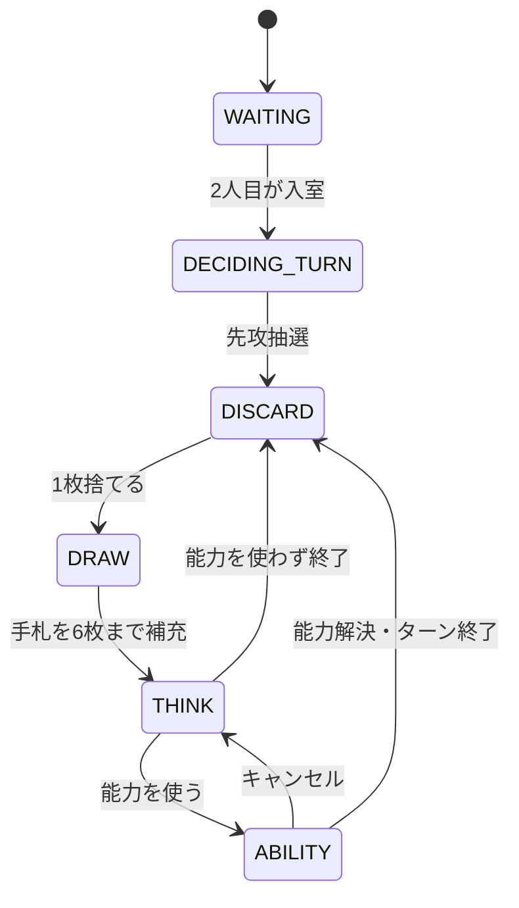

# ESPER 開発スタンダードガイド

## 1. 目的

この文書は、`esper-game-web` の全体構成、実装方針、ゲームロジック、
通信方式、状態管理、テスト方針をまとめた開発者向けの標準ガイドである。

主な目的は次のとおり。

- 初めてコードを読む開発者が、処理の入口と責務の所在を把握できるようにする。
- 機能追加や不具合修正を、適切なファイルとレイヤーへ実装できるようにする。
- ブラウザへ公開してよい情報と、サーバーだけで保持する秘匿情報を区別する。
- ゲームルール、画面表示、HTTP、WebSocketの処理が混在しないようにする。
- HTML/CSS/JavaScript版へ移行した経緯と現行構成を共有する。

本ガイドは `allescdoc/standard_guide` の考え方を参考にし、目的、責務、
依存方向、実装時の判断基準、禁止事項、例外を明示する。

## 2. 対象範囲と現在の位置づけ

正式なアプリケーションは、FastAPIがHTML/CSS/JavaScriptを配信する
ブラウザ版である。旧Flet版の起動・画面ファイルと依存関係は削除済みである。

```text
ブラウザ
  ├─ HTTP APIで操作を送信
  └─ WebSocketで最新状態を受信
        ↓
FastAPI
        ↓
サービス層
        ↓
EsperGame（サーバー内のゲーム状態）
```

### 現在の制約

- ゲーム、セッション、WebSocket接続は単一プロセスのメモリ内に保存する。
- サーバーを再起動すると、進行中の対戦とセッションは失われる。
- 複数ワーカー間ではゲーム状態を共有できない。
- Redis、データベース、分散ロックは未導入である。
- ブラウザ自動操作によるE2Eテストは未導入である。

## 3. 技術構成

| 区分 | 採用技術 | 用途 |
| --- | --- | --- |
| バックエンド | Python / FastAPI | HTTP API、WebSocket、静的ファイル配信 |
| 入力検証 | Pydantic | APIリクエストの型・必須値検証 |
| リアルタイム通信 | WebSocket | 閲覧者別の最新ゲーム状態配信 |
| フロントエンド | HTML / CSS / Vanilla JavaScript | 画面構造、デザイン、状態描画、操作 |
| モジュール方式 | JavaScript ES Modules | `api.js`、`app.js`、`render.js` の分離 |
| テスト | Python `unittest` | ロジック、サービス、API、公開状態、UI境界 |

フロントエンドにゲームの正解状態を持たせず、サーバーを唯一の
信頼できる状態管理元とする、サーバーオーソリティ方式を採用している。

## 4. 開発環境

### 4.1 セットアップ

```bash
cd /workspaces/esper-game-web
python -m pip install -r requirements.txt
```

仮想環境を使用する場合は、上記コマンドの前に仮想環境を作成・有効化する。

### 4.2 ブラウザ版の起動

```bash
python -m uvicorn backend.main:app \
  --reload \
  --host 0.0.0.0 \
  --port 8000
```

| URL | 用途 |
| --- | --- |
| `http://localhost:8000/` | ブラウザゲーム |
| `http://localhost:8000/docs` | OpenAPI |
| `http://localhost:8000/api/health` | ヘルスチェック |

対人戦は、同じブラウザの別タブで同じ「あいことば」を入力して確認できる。
セッションは `sessionStorage` に保存するため、タブごとに別プレイヤーとして
参加できる。

### 4.3 テスト

```bash
python -B -m unittest discover -s tests -v
```

変更後は最低限、対象テストと全テストを実行する。

## 5. ファイル構成

```text
esper-game-web/
├── backend/
│   ├── __init__.py
│   ├── command_service.py
│   ├── connection_manager.py
│   ├── context.py
│   ├── main.py
│   ├── models.py
│   └── session_store.py
├── docs/
│   ├── backend-api.md
│   ├── browser-frontend.md
│   ├── current-behavior.md
│   ├── public-state.md
│   └── service-layer.md
├── frontend/
│   ├── index.html
│   └── static/
│       ├── css/
│       │   └── styles.css
│       └── js/
│           ├── api.js
│           ├── app.js
│           └── render.js
├── schemas/
│   ├── __init__.py
│   └── game_state.py
├── services/
│   ├── __init__.py
│   ├── cpu_service.py
│   ├── game_service.py
│   ├── room_service.py
│   └── state_service.py
├── tests/
│   ├── test_api.py
│   ├── test_frontend.py
│   ├── test_game_logic.py
│   ├── test_services.py
│   └── test_state_service.py
├── game_logic.py
├── requirements.txt
└── esper_development_standard_guide.md
```

## 6. アーキテクチャと依存方向



依存方向は原則として画面・通信からゲームロジックへ向かう。

```text
Frontend
  → FastAPI / CommandService
    → Services
      → EsperGame
```

`StateService` だけは `EsperGame` を読み取り、ブラウザ向けの安全な状態へ
変換する。下位レイヤーからフロントエンドを参照してはならない。

## 7. 各レイヤーの責務

### 7.1 ドメイン状態: `game_logic.py`

`EsperGame` は1対戦部屋分の正解状態を保持する。

主な状態:

- 7種類のカード定義と山札
- ゲーム外カード
- `p1`、`p2` の手札
- プレイヤー別の捨て札グループ
- 現在ターンと処理ステップ
- 能力処理中の一時選択
- タイムリープの追加ターン状態
- CPU戦フラグ
- 再戦要求
- バトルログ、チャット
- 中央通知用のアクションイベント

主な振る舞い:

- 手札の並べ替え
- ESPER成立判定
- プレイヤー・相手・捨て札の参照
- 手札を6枚まで補充
- ターン終了と次ターンへの遷移
- 山札切れ・捨て札上限時の勝敗判定
- 再戦時のゲーム状態初期化

`EsperGame` はHTML、DOM、HTTP、WebSocket、UIフレームワークを参照しない。

### 7.2 ゲームサービス: `services/game_service.py`

`GameService` は、プレイヤー操作によるゲーム状態変更の中心である。

- 先攻抽選
- ESPER宣言
- 通常の捨て札と補充
- 能力選択の開始・キャンセル
- 能力コストの消費
- 7能力の効果処理
- ターン終了
- バトルログ、チャット、中央通知イベントの生成

新しいゲームルールや状態変更は、原則としてここへ実装する。
FastAPIのHTTPハンドラーやJavaScriptへゲームルールを書かない。

### 7.3 CPUサービス: `services/cpu_service.py`

`CpuService` はCPUの判断と、1回分の操作を担当する。

- CPUが現在操作可能か判定する。
- ESPER成立時はほかの行動より先に宣言する。
- 現在の `turn_step` に応じて1ステップだけ進める。
- 難易度に応じて捨て札、能力使用、対象を選ぶ。
- 実際の状態変更は `GameService` を呼び出す。

CPU専用の能力処理を重複実装してはならない。人間とCPUの違いは
「どの操作を選ぶか」であり、選択後の効果は共通の `GameService` を使う。

### 7.4 ルームサービス: `services/room_service.py`

`RoomService` は対戦部屋のライフサイクルを担当する。

- 最初の入室者を `p1`、2人目を `p2` として登録
- 3人目以降の拒否
- CPUルームの作成
- CPUの再戦自動承認
- 両者承認後の再戦初期化
- 退出時のルーム削除

### 7.5 公開状態サービス: `services/state_service.py`

`StateService` は内部状態を閲覧者別のJSON互換データへ変換する。

主な責務:

- 相手手札、山札、除外カード、裏向き捨て札の秘匿
- ゲーム終了時の情報公開
- 閲覧者が実行可能な `available_actions` の生成
- 現在の選択候補 `interaction` の生成
- 能力処理中の一時情報の閲覧者別変換
- 中央通知文面の「あなた」「相手」への変換

`EsperGame.__dict__` や内部リストをそのままレスポンスへ返してはならない。
ブラウザへ送るゲーム状態は必ず `StateService.build_public_state()` を通す。

### 7.6 API境界: `backend/main.py`

FastAPIアプリケーションの入口であり、次を担当する。

- HTMLと静的ファイルの配信
- APIルーティング
- Bearerトークンの解決
- リクエストモデルの受け取り
- ルーム単位のロック
- サービス呼び出し
- HTTPレスポンスとエラー
- WebSocket接続受付
- 操作後の状態配信とCPUタスク開始

APIハンドラーへ能力ルールやカード操作を直接書かない。

### 7.7 コマンド境界: `backend/command_service.py`

`CommandService` はブラウザから受け取った `action` と `payload` を再検証し、
対応する `GameService` へ振り分ける。

実行前に毎回 `StateService` から公開状態を作り直し、次を確認する。

- `action` が現在の `available_actions` に含まれるか
- `index` や `group_index` が現在の候補に存在するか
- 能力カードが現在発動可能か
- プリサイエンスの順序が重複のない完全な並びか

画面でボタンを無効化していても、サーバー側の再検証は省略しない。

### 7.8 アプリケーション共有状態: `backend/context.py`

`ApplicationContext` はFastAPIプロセス内の共有リソースを管理する。

- `rooms`: ルームIDと `EsperGame` の対応
- `sessions`: Bearerセッション
- `connections`: WebSocket接続
- ルーム単位の `asyncio.Lock`
- 先攻抽選タスク
- CPU操作タスク

同じルームへの状態変更はロック内で直列化する。先攻抽選とCPU操作は
バックグラウンドタスクとして実行し、各状態変更後にWebSocket配信する。

### 7.9 WebSocket接続: `backend/connection_manager.py`

`ConnectionManager` はルーム、セッショントークン、WebSocketの対応を保持する。
配信時には接続ごとに `StateService` を呼び、各プレイヤー専用の状態を作る。

同じJSONをルーム全員へ一括送信してはならない。相手手札などの秘匿内容が
閲覧者ごとに異なるためである。

### 7.10 セッション: `backend/session_store.py`

`SessionStore` はランダムトークンと次の情報をメモリ内で関連付ける。

- `room_id`
- `role`
- `player_name`

クライアントが送った役割を信用せず、Bearerトークンからサーバー側で
役割を解決する。

### 7.11 入力・公開型

- `backend/models.py`: PydanticによるHTTPリクエストモデル
- `schemas/game_state.py`: JSON互換値と `PublicGameState` の型別名

入力項目を増やす場合は `backend/models.py` を更新する。
公開状態を変更する場合は `StateService`、関連ドキュメント、テストを
同時に更新する。

## 8. フロントエンドの責務

### 8.1 `frontend/index.html`

画面の意味構造と固定要素を定義する。

- タイトル画面
- 対戦画面
- プレイヤー、山札、手札、捨て札の表示領域
- アクション、バトルログ、チャット
- 能力一覧
- 確認モーダル
- 中央通知オーバーレイ

ゲーム状態によって変わる内容はJavaScriptが描画する。
HTMLへゲームロジックやインラインJavaScriptを書かない。

### 8.2 `frontend/static/css/styles.css`

見た目だけを担当する。

- 色、余白、フォント、カード表現
- レイアウト
- モーダル
- 選択・新規ドロー・追加ターン・通知の視覚効果
- PC、タブレット、スマートフォンのレスポンシブ表示

状態変更をCSSで表現する場合は、JavaScriptが意味のあるクラスを付け、
CSSはそのクラスの見た目だけを定義する。

### 8.3 `frontend/static/js/api.js`

サーバー通信とブラウザセッションを担当する。

- HTTPリクエスト
- Bearerトークン付与
- APIエラーの共通化
- `sessionStorage` へのセッション保存
- WebSocket接続、切断、再接続
- 初回WebSocket状態の通知抑制

DOMの組み立てやゲームルールは実装しない。

### 8.4 `frontend/static/js/app.js`

アプリケーション全体の画面制御を担当する。

- タイトル画面と対戦画面の切り替え
- 入室、CPU戦、チャット、退出のイベント
- API呼び出し中の多重操作防止
- トースト表示
- 保存済みセッションからの復帰
- `renderGame()` への状態引き渡し
- WebSocket接続の開始

### 8.5 `frontend/static/js/render.js`

公開状態をDOMへ反映し、現在実行できる操作を表示する。

- カード、手札、捨て札、山札枚数の描画
- `available_actions` と `interaction` から操作ボタンを生成
- 捨て札・能力・対象の確認モーダル
- プリサイエンスの順序選択
- サイコキネシス、ヒーリング、クレヤボヤンスの盤面選択同期
- 新しく引いたカードの一時ハイライト
- ターン交代、相手の行動、追加ターンの中央通知キュー
- ログとチャットの描画

`render.js` は表示上の一時状態を保持することがある。

- プリサイエンスでクリックした順序
- サイコキネシスのモーダル表示前の選択
- 最後に表示したアクションイベントID
- 通知キュー
- 直前の手札枚数と新規ドローカードの表示開始時刻

これらは演出・操作補助用であり、ゲームの正解状態ではない。
実行結果は必ずAPIへ送り、返された公開状態で再描画する。

## 9. リクエストから画面更新までの流れ

### 9.1 入室



2人目の入室後は、`ApplicationContext` が先攻抽選を予約する。

### 9.2 ゲーム操作



HTTP応答とWebSocketで同じイベントが届く場合がある。中央通知は
単調増加するイベントIDで重複を除外する。

### 9.3 CPU操作

```text
人間または先攻抽選の処理完了
  → schedule_cpu()
  → CPUが操作可能か確認
  → ルームロック
  → 1操作開始を予約
  → 待機
  → CpuService.take_step()
  → 状態配信
  → 次のCPUステップがあれば繰り返す
```

CPUは1回の呼び出しでターン全体を一気に完了させず、
`DISCARD`、`DRAW`、`THINK`、能力選択などを1ステップずつ進める。

## 10. ゲーム状態とターンステップ

### 10.1 通常ターン



能力によっては `ABILITY` から専用の選択ステップへ遷移する。

| ステップ | 意味 |
| --- | --- |
| `WAITING` | 2人目の入室待ち |
| `DECIDING_TURN` | 先攻抽選待ち |
| `DISCARD` | 通常捨て札を1枚選ぶ |
| `DRAW` | 手札を補充する |
| `THINK` | 能力使用かターン終了を選ぶ |
| `ABILITY` | 通常能力を選ぶ |
| `MIMIC_SELECTION` | カモフラージュで使う能力を選ぶ |
| `TELEPORT_SELECTION` | 宣言するカード種類を選ぶ |
| `PSY_DISCARD_SELECTION` | 相手手札の対象を選ぶ |
| `PSY_PUSH_SELECTION` | 相手の裏向き捨て札を選ぶ |
| `REGEN_SELECTION` | ヒーリング対象を選ぶ |
| `CLAIR_SELECTION` | クレヤボヤンス対象を選ぶ |
| `CLAIR_REVEAL` | 透視結果を確認する |
| `PRESCIENCE_SELECT_1/2` | 山札へ戻す順序を指定する |
| `GAME_CLEAR` | ESPER宣言による決着 |
| `GAME_OVER` | 自動判定による決着 |
| `ROOM_DISBANDED` | 対戦相手退出による終了 |

ステップを追加する場合は、最低限次を同時に見直す。

- `GameService` の遷移
- `StateService._available_actions()`
- `StateService._interaction()`
- `CommandService.execute()`
- `CpuService.ACTIVE_STEPS` と `take_step()`
- `render.js` の案内文と操作描画
- 関連テスト

## 11. カードと基本ルール

### 11.1 カード構成

- 7種類を各8枚、合計56枚使用する。
- シャッフル後、3枚をゲーム外カードにする。
- `p1`、`p2` へ6枚ずつ配る。
- 配札後の山札は41枚になる。
- 山札の末尾を「上」として `pop()` でドローする。

カード種類:

1. クレヤボヤンス
2. タイムリープ
3. サイコキネシス
4. プリサイエンス
5. テレポート
6. ヒーリング
7. カモフラージュ

### 11.2 捨て札

- 通常ターンでは手札から1枚捨てる。
- 自分の裏向き捨て札が5枚未満なら裏向きにする。
- 裏向き捨て札が5枚に達した後の通常捨て札は表向きにする。
- 能力コストと能力効果で捨てるカードは表向きにする。
- 同時に捨てた複数枚は1つの捨て札グループとして保持する。

捨て札は単純なカード配列ではなく、次のようなグループ配列である。

```python
[
    [
        {
            "name": "タイムリープ",
            "is_face_up": True,
            "owner": "p1",
        }
    ]
]
```

ヒーリングやサイコキネシスはグループ位置を参照するため、
構造を変更する場合は能力処理と公開状態を同時に見直す。

### 11.3 能力コスト

- 通常能力は、同名カード2枚を表向きの1グループとして捨てて発動する。
- カモフラージュ自体は通常能力として発動しない。
- カモフラージュは、カモフラージュ2枚と対象能力カード1枚を捨て、
  対象カードの能力として発動する。
- 山札が1枚以下では、ヒーリング以外の通常能力を無効にする。
- 山札が2枚以下では、ヒーリング以外へのカモフラージュを無効にする。

### 11.4 ESPER判定

- 同じ種類のカード5枚以上で成立する。
- カモフラージュ5枚以上でも成立する。
- カモフラージュ2枚を、ほかの種類1枚分のワイルドカードとして数える。
- 余ったカモフラージュ1枚はワイルドカードにしない。
- ゲーム終了前なら相手ターンでも宣言できる。

## 12. 7能力の処理

### 12.1 クレヤボヤンス（千里眼）

1. 相手手札と相手の裏向き捨て札から最大2枚選ぶ。
2. 選択中はカード名を公開しない。
3. 確認ステップで、発動者にだけ選択したカード名を公開する。
4. 相手向け通知には、実際に見られた本人のカード名を表示する。
5. 発動者の手札を6枚まで補充し、ターンを終了する。

0枚のまま確定することもできる。

### 12.2 タイムリープ（時間移動）

1. 発動者の手札を6枚まで補充する。
2. `extra_turn` を有効にする。
3. ターン終了処理で相手へ交代せず、同じプレイヤーの `DISCARD` へ戻す。
4. 追加ターンの連続回数を `extra_turn_chain` で管理する。

画面では連続回数を4段階の色で表現する。ゲームロジック上は
4回で打ち切るのではなく、5回目以降もレベル4の色を使用する。

### 12.3 サイコキネシス（念力）

1. 相手手札から1枚を選び、表向きで捨てさせる。
2. 相手の「1枚だけで構成された裏向き捨て札」を1グループ選ぶ。
3. 選んだ捨て札を相手の手札へ戻す。
4. 発動者の手札を6枚まで補充する。
5. ターンを終了する。

戻せる裏向き捨て札がない場合は、最初に捨てさせたカードを相手の手札へ
戻し、表向き捨て札への追加も取り消す。

### 12.4 プリサイエンス（未来予知）

1. 山札の上から最大3枚を取り出す。
2. 発動者が上から1枚目、2枚目、3枚目の順序を指定する。
3. 指定順になるよう、山札の末尾へ逆順で戻す。
4. 通常の手札補充を行う。
5. ターンを終了する。

通常発動では能力コストにより手札が4枚になるため、指定した1枚目と2枚目を
直後の補充で引く。指定した3枚目は山札の一番上に残り、次のドロー対象になる。

### 12.5 テレポート（瞬間移動）

1. 7種類から1種類を宣言する。
2. 相手手札にある宣言カードをすべて取り除く。
3. 取り除いたカードを表向きの1グループとして捨てる。
4. 相手と発動者を6枚まで補充する。
5. ターンを終了する。

宣言カードが0枚でも能力は完了する。両者の補充に必要な合計枚数が
山札枚数を超える場合は引き分けにする。

### 12.6 ヒーリング（再生）

1. 両プレイヤーの捨て札から最大3枚選ぶ。
2. 選んだカードを元の捨て札グループから取り除く。
3. 空になった捨て札グループを削除する。
4. 選んだカードを山札へ戻す。
5. 山札全体をシャッフルする。
6. 発動者の手札を6枚まで補充する。
7. ターンを終了する。

相手の裏向きカード名は選択中も公開しない。0枚のまま確定できる。

### 12.7 カモフラージュ（擬態）

1. カモフラージュ2枚を用意する。
2. 手札にある別能力のカード1枚を対象として選ぶ。
3. 合計3枚を表向きの1グループとして捨てる。
4. 選択したカードの能力へ処理を委譲する。

能力名と通知では、カモフラージュ経由の発動であることを保持する。

## 13. ターン終了と勝敗

`EsperGame.end_action()` は次の順で判定する。

1. 山札が0枚なら自動決着する。
2. どちらかの捨て札グループが18組以上なら自動決着する。
3. タイムリープが有効なら同じプレイヤーの追加ターンへ進む。
4. それ以外は相手のターンへ進む。

自動決着では次の順に勝敗を決める。

1. 両者がESPERなら引き分け
2. 片方だけESPERならそのプレイヤーの勝利
3. どちらも未達成なら、手札の同種枚数を降順に並べて辞書式比較
4. 構成が同じなら引き分け

## 14. 公開状態と秘匿情報

### 14.1 基本方針

サーバー内部の `EsperGame` は、両者の手札や山札内容をすべて保持する。
そのままブラウザへ送ってはならない。

| 情報 | 通常時 | ゲーム終了時 |
| --- | --- | --- |
| 自分の手札 | カード名を公開 | 公開 |
| 相手の手札 | 枚数のみ | カード名を公開 |
| 山札 | 枚数のみ | 内容は非公開 |
| ゲーム外カード | `null` | カード名を公開 |
| 自分の裏向き捨て札 | カード名を公開 | 公開 |
| 相手の裏向き捨て札 | `null` | 現状は向きのルールに従う |
| 表向き捨て札 | カード名を公開 | 公開 |

### 14.2 `available_actions`

現在の閲覧者が実行できる操作名だけを返す。

- 相手ターンでは通常操作を返さない。
- ESPER成立時は相手ターンでも宣言を許可する。
- 終了時は再戦と退出だけを返す。
- 山札不足などで無効な能力は実行可能にしない。

フロントエンドは独自にターンルールを再計算せず、
`available_actions` を操作表示の基準にする。

### 14.3 `interaction`

現在の操作に必要な選択候補を返す。

- 通常捨て札の手札index
- 発動可能な能力
- テレポートの宣言候補
- サイコキネシスの伏せ対象
- ヒーリングの盤面位置
- クレヤボヤンスの選択・公開情報
- プリサイエンスの閲覧カードと順序

相手の伏せカードを選ぶ場合、サーバー内部のカード名ではなく、
公開されたindexやグループ番号をクライアントへ渡す。

## 15. APIとWebSocket

### 15.1 HTTP API

| Method | Path | 説明 |
| --- | --- | --- |
| `GET` | `/api/health` | 稼働確認 |
| `POST` | `/api/rooms/join` | 対人ルームへ入室 |
| `POST` | `/api/rooms/cpu` | CPUルーム作成 |
| `GET` | `/api/rooms/{room_id}/state` | 最新公開状態取得 |
| `POST` | `/api/rooms/{room_id}/actions` | ゲーム操作 |
| `POST` | `/api/rooms/{room_id}/chat` | チャット送信 |
| `POST` | `/api/rooms/{room_id}/rematch` | 再戦要求 |
| `POST` | `/api/rooms/{room_id}/leave` | 退出・ルーム解散 |

入室後のHTTP APIでは次のヘッダーを使用する。

```http
Authorization: Bearer <token>
```

### 15.2 WebSocket

```text
ws://localhost:8000/ws/rooms/{room_id}?token={token}
```

接続直後と状態更新時に、次の形式で公開状態を受信する。

```json
{
  "type": "state",
  "data": {
    "version": 1
  }
}
```

WebSocketは状態更新通知に使用し、ゲーム操作自体はHTTP APIで行う。
`ping` を送ると `pong` を返す。

## 16. 中央通知と画面演出

`EsperGame.action_events` は、相手の行動や能力結果を中央表示するための
イベント履歴である。

イベントの主な項目:

- 単調増加する `id`
- 実行者の役割
- イベント種類
- 閲覧者別のタイトル・詳細・色調
- 表示時間

色調:

- `normal`: 通常の手札入れ替え
- `ability`: 能力の実行結果
- `impact`: 自分の手札・盤面が変更された結果
- `time_leap`: 追加ターン専用演出

サーバーは直近100件を保持する。フロントエンドはID順に通知キューへ積み、
1件ずつ表示する。初回接続、再接続、再読み込み時は過去イベントを再生しない。

新規ドローカードは、手札のカード名と同名カード内の出現順を使って追跡し、
3秒間薄いオレンジで表示した後、フェードアウトする。この追跡は表示演出であり、
サーバーのゲーム状態へ保存しない。

## 17. 実装時の判断基準

### 17.1 画面の見た目だけを変える

- HTML構造: `frontend/index.html`
- 色、余白、フォント、レスポンシブ: `styles.css`
- 状態に応じた表示切替: `render.js`
- 入室やチャットなど画面全体のイベント: `app.js`

ゲーム状態やAPIを変更する必要はない。

### 17.2 既存状態を使った表示を追加する

1. 公開状態に必要な値がすでにあるか確認する。
2. あれば `render.js` だけで描画する。
3. なければ、秘匿情報でないことを確認する。
4. `StateService` へ閲覧者別の値を追加する。
5. 公開状態テストとフロントエンドテストを追加する。

### 17.3 新しいゲーム操作を追加する

1. `GameService` に状態変更を実装する。
2. `StateService._available_actions()` に実行可能条件を追加する。
3. 必要なら `StateService._interaction()` に選択候補を追加する。
4. `CommandService.execute()` でpayloadを検証してサービスへ渡す。
5. CPUも使う場合は `CpuService` に判断を追加する。
6. `render.js` に操作UIを追加する。
7. サービス、公開状態、API、フロントエンドのテストを追加する。

### 17.4 新しいAPIを追加する

1. 必要な入力モデルを `backend/models.py` に追加する。
2. `backend/main.py` は認証、入力、サービス呼び出し、HTTP応答だけを扱う。
3. ゲーム判断はサービス層へ実装する。
4. 認証・ルーム一致・エラーケースをAPIテストへ追加する。
5. 必要に応じて `docs/backend-api.md` を更新する。

### 17.5 能力を変更する

能力変更は影響範囲が広い。次を必ず確認する。

- 能力コスト
- 専用 `turn_step`
- `GameService` の効果と例外経路
- `StateService` の実行可能条件と選択候補
- 伏せ情報が漏れていないか
- `CommandService` の対象再検証
- CPUの選択
- モーダル、盤面選択、中央通知
- 手札補充とターン終了
- 通常発動とカモフラージュ発動
- 山札不足、対象なし、0枚選択
- 回帰テスト

## 18. コーディング標準

### 18.1 Python

- UIやHTTPに依存しないゲーム処理をサービスへ置く。
- 状態変更関数は、何を変更するか分かる動詞で命名する。
- 閲覧だけのヘルパーと状態変更を区別する。
- 役割は `"p1"`、`"p2"` を使用し、画面表示名と混同しない。
- カード名を外部入力から直接状態変更に使わず、公開候補と照合する。
- 非同期ロック内では、対象ルームの状態確認と変更を一まとまりで行う。
- テストで時間待ちを短縮できるよう、待機秒数は `create_app()` の引数にする。

### 18.2 JavaScript

- `api.js` は通信、`app.js` は画面全体の制御、`render.js` は描画に分ける。
- サーバー状態をクライアント側で先行変更しない。
- 操作中は `busy` で多重送信を防ぐ。
- DOMへ文字列を入れるときは原則 `textContent` を使用する。
- 盤面選択はクリックだけでなく、EnterとSpaceでも操作可能にする。
- モーダル確定前にAPIを実行しない。
- HTTP応答とWebSocketの重複を考慮する。

### 18.3 HTML

- 画面構造とアクセシビリティ上の意味を優先する。
- ボタンには `type="button"` または適切な送信種別を指定する。
- 動的な通知には `role="status"`、`aria-live` を適切に使用する。
- アイコンだけのボタンには `aria-label` を付ける。
- インラインCSS、インラインJavaScriptは追加しない。

### 18.4 CSS

- 既存の色変数とコンポーネントクラスを再利用する。
- JavaScriptが付与する状態クラスと見た目を分離する。
- PC表示だけでなく、既存のメディアクエリでスマートフォン表示を確認する。
- 長いプレイヤー名、カード名、ルームIDでレイアウトが崩れないようにする。
- `z-index` を増やす場合は、モーダルと中央通知の重なりを確認する。

## 19. 禁止事項

- フロントエンドへ `EsperGame` の内部状態をそのまま送らない。
- 相手手札、山札内容、相手の裏向きカード名を通常レスポンスへ含めない。
- フロントエンドのボタン制御だけを信用して操作を実行しない。
- `backend/main.py` に能力処理を直接実装しない。
- `CpuService` に人間用とは別の能力効果を実装しない。
- `render.js` で勝敗、能力成否、ドロー結果を確定しない。
- WebSocketで全プレイヤーへ同一の内部状態を配信しない。
- ルームロックを使わず、非同期タスクからゲーム状態を変更しない。
- 仕様変更時にテストと関連ドキュメントを更新せず放置しない。

## 20. テスト方針

| ファイル | 主な検証対象 |
| --- | --- |
| `test_game_logic.py` | 初期配札、カード総数、ESPER、補充、勝敗、ターン、再戦 |
| `test_services.py` | 通常操作、7能力、通知、CPU、ルーム |
| `test_state_service.py` | 秘匿情報、操作候補、能力中の公開状態 |
| `test_api.py` | 認証、API、payload再検証、WebSocket、非同期処理 |
| `test_frontend.py` | HTML/CSS/JS分離、モーダル、選択同期、通知、演出 |

### 変更別の最低テスト

- ゲームルール変更: `test_game_logic.py`、`test_services.py`
- 秘匿情報・公開項目変更: `test_state_service.py`、`test_api.py`
- API変更: `test_api.py`
- 表示・操作変更: `test_frontend.py`
- レイヤー移動: 関連するサービス・API・フロントエンドテスト

秘匿情報のテストでは、単にフィールドが `null` であることだけでなく、
レスポンス全体をJSON化して秘密のカード名が含まれないことを確認する。

## 21. ローカル結合確認

ブラウザ版を正式運用へ切り替える前に、次を確認する。

- CPU初級・中級・上級で通常ターンが完了する。
- 別タブの対人戦で両者の表示がリアルタイム更新される。
- 7能力の通常発動とカモフラージュ発動が完了する。
- モーダルの戻る・確定が正しく動く。
- 選択状態がアクション欄と盤面で一致する。
- 相手の伏せカード名が開発者ツールのレスポンスにも含まれない。
- ターン交代、相手行動、手札変更、タイムリープが中央表示される。
- 通知が重複せず順番に消える。
- チャット、バトルログ、再戦、退出が動作する。
- 再読み込み後に同じタブのセッションへ復帰する。
- PCとスマートフォンでレイアウトが崩れない。

## 22. 今後の拡張方針

旧Flet版の廃止とFastAPIへの起動一本化は完了している。
以後の画面機能は `frontend/`、通信機能は `backend/`、
ゲームルールは `services/` と `game_logic.py` へ実装する。

永続化や複数ワーカー対応を行う場合は、次の設計変更が必要になる。

- ルームとセッションのRedisまたはDB保存
- WebSocket接続先をまたぐPub/Sub
- ルーム単位の分散ロック
- バックグラウンドタスクの多重実行防止
- 再起動後のセッション復元戦略

## 23. 関連ドキュメント

- `docs/current-behavior.md`: ゲームルールと移行前挙動
- `docs/service-layer.md`: サービス層の分離方針
- `docs/public-state.md`: 閲覧者別の公開状態と秘匿ルール
- `docs/backend-api.md`: HTTP API、WebSocket、認証
- `docs/browser-frontend.md`: ブラウザ画面の構成と動作

本ガイドは開発全体の入口として使用し、個別のJSON例や詳細なAPI仕様は
上記ドキュメントを参照する。
